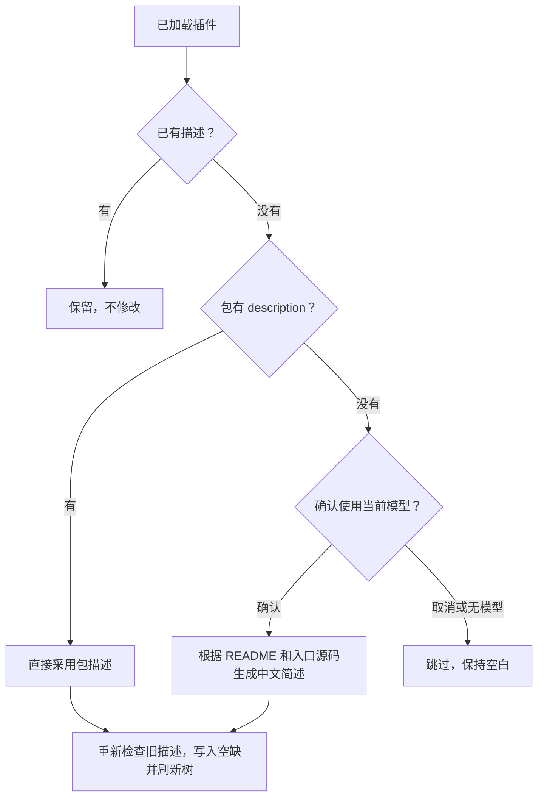
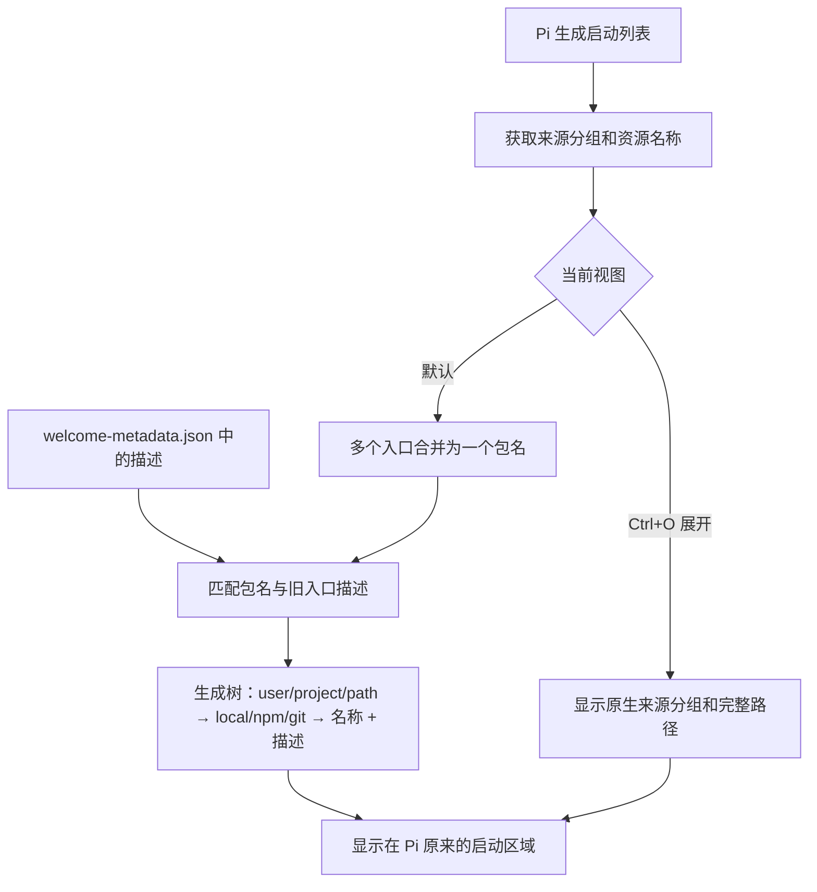

# pi-package-list

以标准树形线条展示 `user/project/path → local/npm/git → 名称 + metadata`，隐藏扩展入口后缀和重复包标题，无需按 Ctrl+O。

```text
[Extensions]
└── user
    ├── local
    │   ├── ask-user         交互式需求确认
    │   └── pi-package-list  启动资源列表与描述
    └── npm
        └── @ff-labs/pi-fff  模糊文件/内容搜索
```

## 安装

需要 Node.js 24+ 和 Pi。当前兼容性验证基线：Pi **0.99.1**。

当前 **0.3.0 为本地开发版本，尚未发布**。下方 Git 命令安装已发布的 0.2.0，不包含本次简化展示；要使用新功能，请按本地开发方式安装。

```sh
pi install git:github.com/littlecabbage/pi-package-list@v0.2.0
```

本地开发：

```sh
git clone https://github.com/littlecabbage/pi-package-list.git
cd pi-package-list
npm test
pi install "$PWD"
```

首次安装后执行 `/reload` 或重启 Pi。**更新插件代码后请退出并重启 Pi**：当前进程的原型补丁不会因 `/reload` 自动替换，原因见下方实现原理。不要同时加载旧的 `welcome-list.ts` 或其他副本。

## 自动补充描述

```text
/pi-package-list update
```

只处理**当前已加载的 Extensions**，不会升级插件，也不会修改已有非空描述（包括旧入口键的描述）。



- 包描述保留原语言；模型生成一句中文说明，不调用工具、不创建子 agent。
- 模型请求前会确认：会向**当前模型提供方**发送本地 README/入口源码片段，并消耗额度。每个包最多取三个入口，资料上限 12000 字符；不发送会话、凭据文件或完整目录。
- 只做常见密钥模式脱敏，不能保证识别所有敏感内容；敏感插件请选择取消。取消确认仍会补充可直接读取的包描述。
- 模型不可用、超时或返回无效内容时跳过对应项，不编造描述。
- 写入完成会刷新树，无需重启。**首次加入此命令仍需重启 Pi**以加载新代码。

取消正在运行的更新：`/pi-package-list cancel`。会放弃本次尚未写入的结果；退出、切换或重载会话触发 shutdown 时也会取消。

<details>
<summary>写入保护和模型调用细节</summary>

命令使用官方 `registerCommand()`，已加载插件清单由隔离的宿主兼容层提供。模型调用使用 `ctx.modelRegistry.streamSimple()` 和当前 `ctx.model`，仅传入参考资料及摘要指令，不附带当前聊天记录或工具。每项请求上限 60 秒，最多输出 512 tokens，要求 JSON `description`；空摘要不写入。成功解析的响应 usage 作为自定义会话条目记录，不保证计入 Pi 原生用量统计。

`src/metadata-update.ts` 收集候选描述；`src/update-command.ts` 管理确认、并发保护、取消和进度。模型等待结束后，在宿主 `withFileMutationQueue()` 内重新读取 metadata，再检查新名称及旧别名，避免覆盖期间新增的手写描述。只改 `extensions` 空缺项，其余字段保留；无效 JSON 或无效 extensions 格式直接报错。写入使用同目录临时文件和 rename，防止半写文件；不提供跨进程编辑锁。

</details>

## Metadata

为兼容旧配置，继续读取 Pi agent 目录下的 `welcome-metadata.json`（默认 `~/.pi/agent/welcome-metadata.json`，实际路径由 Pi 的 `getAgentDir()` 决定）。此文件是用户数据，不属于插件源码，不会上传到仓库。

```json
{
  "extensions": {
    "pi-package-list": "启动资源列表与描述",
    "@ff-labs/pi-fff": "模糊文件/内容搜索",
    "ask-user": "交互式需求确认"
  },
  "skills": {
    "pi-subagents": "子代理操作指南"
  }
}
```

建议以默认视图中的名称作为键名，例如 `@ff-labs/pi-fff`。插件兼容旧入口键（如 `@ff-labs/pi-fff:src`、`cannbot-proxy.ts`、`extensions`）：新名称的非空描述优先，否则读取旧入口描述；同一包的多个不同描述去重后用 ` / ` 合并。插件自动登记新名称，描述默认为空，不覆盖或删除旧描述。支持 `context`、`skills`、`prompts`、`extensions`、`themes`。无效 JSON 或读写失败时不覆盖原文件。

默认视图中，Extensions、Skills、Prompts 先按 Pi 提供的 `project` / `user` / `path` 分组，再按 `local` / `npm` / `git` 分类。Extensions 每个包只显示一行，隐藏 `:src` 等入口后缀；本地 Pi 包从就近的 `package.json` 读取名字（如 `pi-package-list`、`pi-ego`），独立脚本隐藏 `.ts` / `.js` 后缀。Skills 和 Prompts 保留各自名称，不合并为包。显示名称和描述，不显示完整文件路径。Context 继续逐项显示，因 Pi 不为它构建这些来源分组。Ctrl+O 仍可切换到完整来源和路径视图。缺少可识别的宿主分组或名称数据时回退到普通名称列表，不猜测来源。沿用旧插件行为：隐藏 `[Themes]` 及其后空行，保留诊断警告。

## 实现原理

插件只改变**怎么显示**，不安装、卸载或重复加载插件。



**一句话：**拿到 Pi 的来源信息 → 合并入口 → 配上描述 → 画成树。Skills 和 Prompts 保留各自名称，不合并成包。

<details>
<summary>展开技术细节：数据捕获、metadata 兼容、树形渲染与重启原因</summary>

### 1. 捕获来源，不解析文字猜分组

`extensions/index.ts` 创建 metadata store，并通过 `src/host-patch.ts` 的 `installPackageListPatch()` 包装 `InteractiveMode.prototype.showLoadedResources()`。每次 Pi 生成列表期间，临时包装当前实例的：

- `buildScopeGroups()`：捕获 Pi 已识别的 `project` / `user` / `path`、资源路径及 npm/git 包来源。
- `getCompactExtensionLabels()`：记录资源路径到原生简短入口名称的映射，用于兼容已有 metadata 键。
- `loadedResourcesContainer.addChild()`：在资源组件加入容器时，根据节标题关联对应来源数据并包装文字生成函数。

Skills 名称来自资源加载器，Prompts 名称来自会话的 prompt templates。来源分组沿用 Pi 的判断；不根据显示名称猜测安装范围。上述临时方法在 `finally` 中恢复，宿主生成列表时抛出异常也会清理。

### 2. 将入口收敛为名称和 metadata

`nameScopeGroups()` 将捕获的数据转换为显示数据，`groupedSectionToList()` 按来源前缀归入 `local` / `npm` / `git`（未知类型归入 `other`）。Extensions 不再逐项显示包入口：

- npm/git 包使用 Pi 的包来源名称，同一来源类别中的同名包合并为一行。
- 本地包由 `src/package-name.ts` 从入口所在目录向上最多检查四层 `package.json`，读取带 `pi` manifest 的包名；遇到最近的非 Pi 包边界或无效 JSON 时停止，不继承外层包名。
- 找不到本地包名时保留 Pi 的简短名称，仅去掉脚本扩展名。Skills 和 Prompts 仍显示各自资源名称。

每行同时携带旧入口键作为 metadata 别名。`resourceRows()` 优先读取新名称的非空描述，否则读取旧入口描述并去重合并。因此隐藏 `:src`、`.ts` 等入口信息不会丢掉已有说明。新显示名称自动登记到配置文件，旧键不会被删除。

### 3. 递归生成树形线条

`src/list.ts` 将显示数据构建为三层 `TreeNode`：scope、来源类别、名称与描述。`renderTree()` 按同级节点位置输出：

- 非最后节点使用 `├──`，最后节点使用 `└──`。
- 父节点后还有兄弟节点时，子树前缀保留 `│   `；否则使用四个空格。
- 空来源类别和空 scope 不生成节点，避免悬空分支。

名称先排序、去重，描述在同一来源类别内按名称长度补空格对齐。树形文字沿用原组件的 ANSI 样式；终端换行与宽度处理仍由 Pi 的文字组件负责，不创建第二套 TUI。

### 4. 默认树形与完整路径切换

Pi 0.99.1 的 `ExpandableText` 将收起/展开文字生成函数保存在闭包中，不再提供旧的 getter。插件包装它继承自 `ThemedText` 的 `build()`，读取 `state.expanded`：

- 收起：生成包名与 metadata 树。
- 展开：沿用 Pi 的原生来源和路径文字，仅为资源叶子行添加项目符号。

这样默认启动即可看到树形，Ctrl+O 仍能查看路径。`build()` 每次先调用原生成函数，因此主题变化后仍会获取新的颜色。旧 getter 形式也保留兼容分支；缺少可识别分组或名称数据时回退到普通列表。

### 5. 为什么更新代码需要重启

补丁通过 `Symbol.for("pi-package-list:loaded-resources")` 在宿主原型上标记，避免同一进程重复包装。`/reload` 虽然重新加载扩展，但不会移除该标记或替换已安装补丁的闭包，因此更新实现后需要重启 Pi。metadata 则由 store 在读取时刷新，不需要重新安装补丁；界面会在文字组件下一次重建时反映描述变更。

</details>

## 兼容性边界

包结构遵循官方 [Pi Packages](https://github.com/earendil-works/pi/blob/main/packages/coding-agent/docs/packages.md) 规范，入口默认导出 extension factory，宿主依赖使用 `peerDependencies: "*"`，无新增第三方依赖。

**修改原生启动列表不是官方稳定扩展 API。** `src/host-patch.ts` 隔离了对 `InteractiveMode.showLoadedResources`、`loadedResourcesContainer` 和 `ExpandableText` 的补丁，兼容旧 getter 形式及 Pi 0.99.1 的 `ThemedText.build` 闭包形式。Pi 内部结构再次改变时可能需要适配；缺少入口方法会提示警告，未知组件保持原样。非 TUI 模式不增加界面。

## 项目结构

```text
extensions/index.ts       官方包入口
src/list.ts               列表转换与 metadata 存储
src/host-patch.ts         宿主内部 API 兼容层
src/package-name.ts       本地 Pi 包名称和 manifest 读取
src/metadata-update.ts    描述收集、模型输出校验及原子写入
src/update-command.ts     update/cancel 命令及模型调用
tests/                    Node.js 原生回归测试
.github/workflows/test.yml CI
CHANGELOG.md              版本变更记录
```

## 开发与版本管理

```sh
npm test
npm run check
```

测试覆盖树形分支与末尾节点、来源分类、包入口合并、旧 metadata 兼容、规范包描述优先、本地包名称识别、换行、ANSI、旧/新宿主、展开/收起、主题重建、重复安装、诊断保留和异常清理。无须安装依赖即可运行测试；宿主导入由 Pi 加载器提供。

采用 SemVer：兼容修复增加 patch，新功能增加 minor，不兼容变更增加 major（0.x 阶段破坏性改动增加 minor）。发布前更新 `package.json` 和 `CHANGELOG.md`、通过检查，再提交并创建对应 `vX.Y.Z` tag 和 GitHub Release。当前仅通过 GitHub 分发，不发布 npm。

安装 tag 会固定版本；升级时安装新的 tag。使用不带 tag 的 git source 则可用 `pi update git:github.com/littlecabbage/pi-package-list` 跟随仓库更新。

## License

MIT
